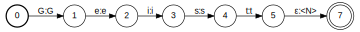
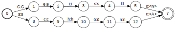
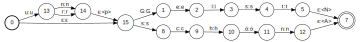
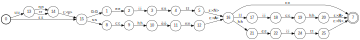
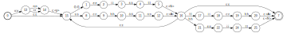
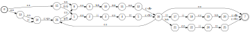
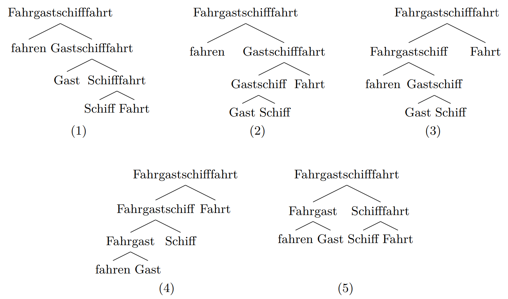

layout: true

<div class="my-header"></div>

<div class="my-footer">
  <table>
    <tr>
      <td>timur: Finite-state morphology for German</td>
      <td style="text-align:right"><a href="https://wrznr.github.io/timur/">wrznr.github.io/timur</a></td>
    </tr>
  </table>
</div>

---

class: title-slide

# timur

## Morphologische Zerlegung mittels endlicher Automaten


| Kay-Michael Würzner |
|:-------------------:|
| [wuerzner@bbaw.de](mailto:wuerzner@bbaw.de) |

---

# Überblick

- Morphologische Analyse
- timur
    + grundlegende Ideen
    + Implementierung
    + aktueller Stand
- Anwendungen
- Diskussion und Ausblick

---

# Morphologische Analyse

- Aufgaben
    + Bestimmung der **möglichen** Wortarten eines Wortes
      ```
      grünen ↦ {Verb, Adjektiv}
      Müller ↦ {Substantiv, Eigenname}
      ```
    + Abbildung auf eine kanonische **Grundform** (*Lemma*)
      ```
      grünen  ↦ grün
      Müllers ↦ Müller
      ```
    + Identifikation der beteiligten Wortbildungsprozesse
      ```
      Grünspan ↦ grün<A>Span<N>
      verirren ↦ ver<p>irren<V>
      ```
---

# Morphologische Analyse

- Operanden:
    + **freie Morpheme**: isoliert auftretende Wörter/Wortbestandteile (*Stamm*)
    + **gebundene Morpheme**: nur in Kombination mit freien Morphemen auftretende Wörter/Wortbestandteile (*Affix*)
    + **Zwischenstatus**: nicht isoliert auftretende Wortstämme (*Formativ*)
- Prozesse
    + **Flexion**: Kombination eines Wortes mit einem oder mehreren Affixen zur Erfüllung morphosyntaktischer Umgebungsanforderungen
    + **Derivation**: Kombination eines freien Morphems mit einem Affix zur Änderung von Wortart und/oder Bedeutung
    + **Konversion**: Änderung der Wortart eines Stammes **ohne** Affixinvolvierung
    + **Komposition**: Kombination zweier freier Morpheme

---

# Morphologische Analyse

- Analyseebenen
    + **Oberfläche**: sichtbare Gestalt der einzelnen Morpheme (i.e. Morphe)
        * phonotaktische Prozesse (Fugenelemente, Ab- und Umlaut)
        * Flexion
    + **Tiefe**: (abstrakte) Repräsentation aller Morpheme
- Anwendungsbezug
    + z.B. morphologische Zerlegung
        * Einschätzung der Bildungsproduktivität einzelner Morpheme: Tiefe
        * Unterstützung der Wortrennung: Oberfläche
    + z.B. Grundformbildung
        * Oberfläche **plus** Tiefe

```
Ärztekammern:
   ↦ Ärztekammer<NN>
   ↦ Ärzte#kammer~n
   ↦ Arzt<NN>Kammer<NN>
```

---

# Morphologische Analyse

- Verfahren des maschinellen Lernens nicht geeignet
- Herausfordend für Sprachen mit komplexer Wortbildung
- `Finite State Morphology` (klassischer regelbasierter Ansatz):
    + Man nehme
        * eine **große** Liste einfacher Wörter
        * deren **morphosyntaktische** Eigenschaften
        * Vor- und Nachsilben,
    + packe dies in einen **endlichen Automaten** und
    + bilde dessen **Kleenesche Hülle**
- Bestandteil der meisten Sprachverarbeitungssysteme

---

# Morphologische Analyse

- Illustration
    + Lexikon `{schön<A>,Geist<N>}`
    + Vorsilben `{un<p>,ur<p>}`
    + Nachsilben `{heit<N>,lich<A>}`

.center[.img-orig[]]

---

count: false

# Morphologische Analyse

- Illustration
    + Lexikon `{schön<A>,Geist<N>}`
    + Vorsilben `{un<p>,ur<p>}`
    + Nachsilben `{heit<N>,lich<A>}`

.center[.img-orig[]]

---

count: false

# Morphologische Analyse

- Illustration
    + Lexikon `{schön<A>,Geist<N>}`
    + Vorsilben `{un<p>,ur<p>}`
    + Nachsilben `{heit<N>,lich<A>}`

<center></center>

---

count: false

# Morphologische Analyse

- Illustration
    + Lexikon `{schön<A>,Geist<N>}`
    + Vorsilben `{un<p>,ur<p>}`
    + Nachsilben `{heit<N>,lich<A>}`

<center></center>

---

count: false

# Morphologische Analyse

- Illustration
    + Lexikon `{schön<A>,Geist<N>}`
    + Vorsilben `{un<p>,ur<p>}`
    + Nachsilben `{heit<N>,lich<A>}`

<center></center>

---

count: false

# Morphologische Analyse

- Illustration
    + Lexikon `{schön<A>,Geist<N>}`
    + Vorsilben `{un<p>,ur<p>}`
    + Nachsilben `{heit<N>,lich<A>}`

<center></center>

---

# Morphologische Analyse

- Schwachpunkte des Ansatzes:
    + Tendenz zur **Übergenerierung**
        * wenige echt produktive Derivationsprozesse!
    + hoher Aufwand bei der **Lexikonpflege**
        * wenige echt produktive Derivationsprozesse!
    + nicht robust
    + **flache Analyse** nicht für alle Anwendungsfälle adäquat
    + Modellierung 
- Vorteile des Ansatzes:
    + schnell (i.e. linear zur Eingabelänge)
    + rel. kompakt (i.e. quadratisch zur Lexikongröße)

---

# timur

- **Schlüsselfakten**:
    + Morphologisches Analysesystem auf Basis endlicher Automaten
        * zugeschnitten auf Wortzerlegung
    + Weiterentwicklung/Konsolidierung einer Wortgrammatik von Helmut Schmid
    + Implementierung in Python mit Hilfe von `pynini`, einer Python-API zu `OpenFst`
    + Open-Source-Entwicklung auf GitHub
- **Motivation**: Es fehlt an Alternativen!
    + wissenschaftlich längst gelöstes Problem
    + begrenzte Verfügbarkeit existierender Werkzeuge (hoher Aufwand bei Lexikonerstellung und -pflege?)
    + veraltete Architekturen für Implementierung und Nutzung

---

# timur im Vergleich

| Software | **TAGH** | **SMOR** | **Morphisto** | **Zmorge** | **timur** |
|:------|:----------:|:--------:|:-------:|:-------------:|:-------------------:|
| OpenSource Framework | (✓) | ✓ | ✓ | ✓ | ✓ |
| OpenSource Lexikon | ✗ | ✗ | ✓ | (✓) | ✓ |
| OpenSource Grammatik | ✗ | (✓) | ✓ | ✓ | ✓ | 
| komplexe Lexikoneinträge| ✓ | ✓ | ✓ | ✓ | ✗ |
| letzte Version | 2017 | 2013 | 2011 | 2015 | 8. Mai 2019 |

---

# timur -- Lexikon

- entstanden auf Basis einer großen Wortliste
    + Wortart
    + **DMOR**-Flexionsklasse (Schiller 1996)
- überarbeitet/annotiert in Kooperation mit Forschungsgruppe REaD (Sascha Schroeder)
    + morphologische Komplexität
    + Bildungsmuster
- Zahlen:
    + 11 989 **Adjektive** davon 774 Simplizia
    + 5 818 **Verben** davon 1 353 Simplizia
    + 24 107 **Nomen** davon 6 105 Simplizia

---

# timur -- Lexikon

| Wort | *Wortart* | *Flexionsklasse* | *komplex?* | *Bildung* |
|:------|:----------:|:--------:|:-------:|:-------------:|
| Acht | `NN` | `NFem/Sg` | ✗ | - |
| achten | `V` | `VVReg` | ✓ | `NN` |
| Achtung | `NN` | `NFem-Deriv` | ✓ | `V + ung` |
| achtbar | `ADJ` | `Adj+` | ✓ | `V + bar` |
| Achtbarkeit | `NN` | `NFem-Deriv` | ✓ | `ADJ + keit` |
| ächten | `V` | `VVReg` | ✓ | `NN$` |
| achtenswert | `ADJ` | `Adj+e` | ✓ | `NN + wert` |

- Ziel: Erstellung einer Baumstruktur pro Simplex

---

# timur -- Lexikon

<center></center>

---

# timur -- Lexikon

- Ziel:
    + Erstellung einer Baumstruktur pro Simplex
    + abhängig von der gewählten Kodierungsstrategie
        * Konvertierung der Lexikoneinträge in **automatenverarbeitbares** Format
        * Gestalt eines komplexen Eintrags abhängig von der Gestalt seines „Vorgängers”
- Herausforderungen:
    + **Lücken** in der Ableitungshierarchie
       * insbesondere im Bereich latinater Wortbildung (*inkommensurabel*)
       * und bei nicht-produktiven Ableitungen produktiv ableitbarer Wörter (*argusäugig*)
    + Ableitungen aus **Formativen** (*Amphitheater*)
    + **Pseudo-** bzw. synchron intransparente Derivationen (*verschwenden*)

---

# timur -- Grammatik

- basierend auf einer Beispielgrammatik von Helmut Schmid
    + auch für `Morphisto` und `Zmorge` genutzt
    + SFST-Format
- Transduktoren für
    + Lexikon
        * Basiseinträge
        * **Affixe**
    + Flexion (Suffixe + Filter)
    + Derivation (Filter)
    + Komposition (Filter)
    + Konversion (Konstruktionsregeln)

---

# timur -- Grammatik

```
<Base_Stems>Arzt<NN><base><nativ><NMasc_es_$e>
<ge><Base_Stems>lern<V><base><nativ><VVReg>
<Kompos_Stems>Ende:<epsilon><NN><kompos><nativ>
<Deriv_Stems>er<Pref>tra:äg<V><deriv><nativ>
<Suff_Stems><prefderiv,simplex,suffderiv>
    <fremd,nativ><deriv><NN>chen<NN><SUFF><base><nativ><NNeut-Dimin>
<Suff_Stems><prefderiv,simplex,suffderiv>
    <fremd,nativ><deriv><NN>chen<NN><SUFF><kompos><nativ>
<Suff_Stems><prefderiv,simplex,suffderiv>
    <fremd,nativ><kompos><NN>los<ADJ><SUFF><base><nativ><Adj+e>
<no-ge><Pref_Stems>zer<PREF><V><nativ>
<Pref_Stems>durch<PREF><V><nativ>
```

- Σ
    + `<X>`: komplexe Symbole
    + `x`: Zeichen (*Letter transducers*!)

---

# timur -- Grammatik

- Lexikoneinträge:
    + **manuell kodierte** Morpheme
    + **automatisch erzeugte** Morpheme
        * jedes (Basis-)Nomen als `<Kompos_Stems>`
        * jeder Verbstamm als `<Deriv_Stems>`
        * ...
        * jedoch nur für **produktive** Prozesse
- automatische **Konversion**
    + Partizipien als Adjektive
    + Infinitive als Nomen
    + (flektierte) Adjektive als Nomen
    + *ge*-Verbstämme als *Ge*-Nomen (*Gerenne* vs. * *Geverliere*)

---

# timur -- Varianten

---

# timur -- Interface

- Python-API mit Kommandozeilenanwendung für Konstruktion und Abfrage
    + basierend auf `pynini`
        * basierend auf `OpenFst`
        * entwickelt von Google
        * Support für „mindestens drei Jahre“
    + **Portierung** von Beispielgrammatik im SFST-Format
    + einzelne Klassen für die Morphologiekomponenten
        * Flexionsklassen
        * Derivationsfilter
        * ...
- (noch?) kein Lexikoneditor
- verfügbar via [`https://github.com/wrznr/timur`](https://github.com/wrznr/timur)

---

# timur -- aktueller Stand

- **Done**:
    + Portierung der Grammatik im wesentlichen abgeschlossen
        * fehlende Flexionsklassen
        * Bugs (vgl. GitHub-Issues)
    + CLI funktional
    + Lexikon**tabelle** bearbeitet
    + Proof-of-Concept für **Grundformbestimmung**
- **ToDo**:
    + Ausgabeformate
    + Webservice
    + Interpretation der Lexikontabelle
        * Auffüllen von Lexikonlücken
        * Generierung des Eingabeformates
    + Abdeckungstests
    + **Generator**

---

# Anwendungsszenarien

- automatisch erzeugte [Artikel](http://zwei.dwds.de/?q=Fahrgastschifffahrt)
    + *Zerlegung* der Suchanfrage
    + *Generierung* der Zwischenebenen
    + *Nachschlagen* der identifizierten Bestandteile
    + *Auswahl* der maximalen Zerlegung zur Abbildung auf bestehende Artikel

<center></center>

---

# Anwendungsszenarien

- Unterstützung der **Worttrennung**
    + Silbenstruktur deutscher Wörter bestimmt durch *Maximum Onset Principle*
        * so viele wie möglich Konsonanten in den Silbenansatz
    + Prinzip durch morphologische Struktur „überstimmt“
        * `verirren ↦ ver-ir-ren` vs.
        * `verifizieren ↦ ve-ri-fi-zie-ren`
        * Präfix- und Kompositionsgrenzen **immer** Silbengrenzen
- aktuell `SMOR` im Einsatz
    + viele komplexe Vollformen lexikalisiert
    + einige nicht-produktive Suffixe produktiv
    + sehr viele Tickets
        * z.B. `Kalkei ↦ kalk<V>ei<NN><Suff>` 
        * z.B. `Seiteneinsteiger ↦ Seiteneinsteiger<NN>` 
- mit timur Kontrolle über das Lexikon **und** die Grammatik

---

# Anwendungsszenarien

- Unterstützung der **Aussprachegenerierung**
    + morphologische Struktur an vielen Stellen der Aussprache sichtbar
        * Glottalverschluss (vor vokalisch anlautenden Wortstämmen, auch in Komposita)
        * Auslautverhärtung ([ˈloː**s**fɛɐ̯ˌfaːʁən])
        * Akzentverteilung („Schweine**'**rei“ vs. „**'**Hühnerei“)
- aktuell erfolgt die Aussprachegenerierung von `gramophone` unabhängig von morphologischer oder Silbenstruktur
    + sehr, sehr viele Tickets

---

# Anwendungsszenarien

- Generierung von **Flexionsparadigmen**

> Guten Tag und erst ein Mal einen herzlichen Dank und meine Komplimente für ihr Projekt. Als niederländischer Muutersprachler Wohne ich seit mehr als 30 Jahren in Deutschland. Dennoch muss ich häufig in Online-Wörterbücher nach mir unbekannte Begriffe, beziehungsweise die Schreibweise deren suchen. Hier ist DWDS. de eine große Hilfe. Jedoch muss ich auch gelegentlich die Konjugation von wenig benutzten Wörtern nach schlagen. Gibt es auf ihrer Seite eine Möglichkeit nach der Konjugation von Verben zu suchen?

- bald! (mit Hilfe der **Generierungskomponente**)

---

# Anwendungsszenarien

- weitere mögliche Einsatzgebiete
    + Korpusindizierung
        * Part-Of-Speech Tagging
        * Wortverlaufskurven
        * Wortprofil (*Arztekammer*)
    + Cascaded Analysis Broker: Zielsprache
    + OCR-Nachkorrektur
    + ...

---

# Diskussion und Ausblick

- Thesen:
    1. Angesichts der erheblich gestiegenen Dynamik bei der Arbeit im Zentrum Sprache ist
       eine Morphologiekomponente mit kurzen Entwicklungszyklen zwingend erforderlich.
    2. Um den Anforderungen der BBAW hinsichtlich der Lizensierung von Software zu
       entsprechen, ist eine quelloffene Morphologiekomponente zwingend erforderlich.
    3. Die Nachfrage nach neuen und verlässlichen computerlinguistischen Webservices
       könnte durch eine Morphologiekomponente auf Basis einer gepflegten,
       veröffentlichten und auf verschiedenen Systemen deploybaren Automatenbibliothek
       beantwortet werden.

---

# Diskussion und Ausblick

- Fertigstellung einer ersten Version bis 08.05.2019
- Optimierung und Anpassung auf die Bedarfe des Zentrums bis Oktober 2019
- Unterstützung in Form von Abdeckungstests, Bugreports, Pull Requests willkommen

Herzlichen Dank für Eure Aufmerksamkeit, für die Zusammenarbeit in den vergangenen
sechzehn Jahren, den Kaffee, die Geduld mit mir und für Eure Existenz überhaupt.
